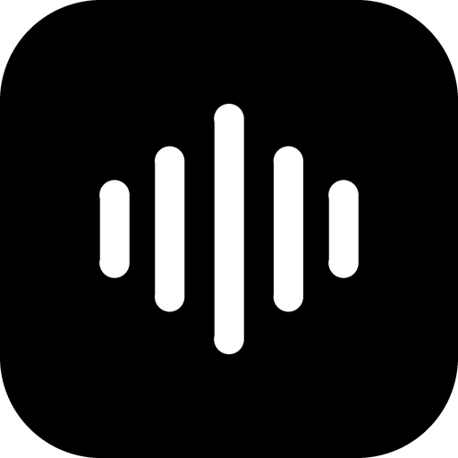
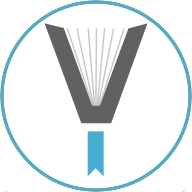

<!---
AcideFluorhydrique/AcideFluorhydrique is a ✨ special ✨ repository because its `README.md` (this file) appears on your GitHub profile.
You can click the Preview link to take a look at your changes.
--->

[🇬🇧English](./README.md)  |  [🇹🇼中文](./README.zh.md)

---

### 👋 Hi, I'm `@AcideFluorhydrique`

Studying **Applied Mathematics** at New York University.
I build small, private, ad-free tools — mostly apps, browser add-ons and self-hosted services.
Everything here is free software, and most of it is mirrored on
[Codeberg](https://codeberg.org/lanticy) and [GitLab](https://gitlab.com/HydrofluoricAcid).

---

## 📱 Android apps

| | Project | What it is | Get it |
|:--:|---|---|---|
|  | **The Last Carrot** [source](https://github.com/AcideFluorhydrique/carrot) | A cheerful lane tower-defence game. No ads, trackers, analytics, permissions or network access. |  |
|  | **Guandan** [source](https://codeberg.org/lanticy/guandan) | The four-player Chinese card game over local Wi-Fi. No server, no account, no sign-up. |  |
|  | **geminiAssist** [source](https://github.com/AcideFluorhydrique/geminiAssist) | A minimal, hardened WebView wrapper for Google Gemini. |  |
|  | **MapConquer** [source](https://github.com/AcideFluorhydrique/mapconquer) | Hex-grid turn-based grand strategy. No ads, no trackers, no permissions. | *in development* |
|  | **Voice Memos** [source](https://github.com/AcideFluorhydrique/voicememos) | An iOS-style voice recorder for Android with an inline player and a real trim editor, built on the [RecorderApp](https://github.com/tuuhin/RecorderApp) engine. |   |

## 🧩 Browser add-ons

| | Project | What it is | Get it |
|:--:|---|---|---|
|  | **Twitter IP Region Display** [source](https://codeberg.org/lanticy/Twitter-IP-Region-Display) | Shows the IP region of accounts on X / Twitter, so you can tell where a post comes from. |  |
|  | **Chrome Simulator** [source](https://codeberg.org/lanticy/Chrome-Simulator) | Makes Firefox look like Chrome to sites that gate on the user agent. Forked from [Chrome Mask](https://github.com/denschub/chrome-mask). |  |
|  | **z-Ιiβrαrγ URL Finder** | Redirects you to a working mirror in one click. |  |
|  | **cBlock Origin** [source](https://codeberg.org/lanticy/cBlock) | uBlock Origin adapted for the mainland-China network: same filtering engine, plus CDN and reachability handling for Chinese sites, served from filter-list mirrors ([cAssets](https://codeberg.org/lanticy/cAssets)). |  |

## 🌐 Services & web

| | Project | What it is | Where |
|:--:|---|---|---|
|  | **DoH Proxy Pro** [source](https://gitlab.com/HydrofluoricAcid/dns) | A DNS-over-HTTPS resolver on Cloudflare Workers: parallel racing across the ten fastest upstreams, circuit breaking, geo-selection and adaptive scoring. Meant to be forked and deployed on **your own** Cloudflare account — I run no shared endpoint. | [fork & self-deploy](https://gitlab.com/HydrofluoricAcid/dns) |
| | **Google Proxy** [source](https://github.com/AcideFluorhydrique/google-proxy) | A one-click Vercel deployment of a google.com mirror, ~100 kB first paint. | [deploy on Vercel](https://github.com/AcideFluorhydrique/google-proxy) |
|  | **Blog** | Notes on the things above, and everything else. | [blog.lanticy.dpdns.org](https://blog.lanticy.dpdns.org) |

## 🛠 Desktop & scripts

| Project | What it is |
|---|---|
| [**OpenRouter Chat Assist**](https://github.com/AcideFluorhydrique/OpenRouter-Chat-Assist) | A Python/Tkinter desktop client that reaches many LLMs through the OpenRouter API — built so people in China can get to them at all. |
| [**Watermarking Mini Program**](https://codeberg.org/lanticy/Watermarking-Mini-Program) | A small Pillow script that tiles a text watermark over photos, with configurable size, colour, rotation, spacing and opacity. |

---

### 🤝 Upstream contributions

I also send patches to projects I use myself. The most notable:

* [**Chrome Mask**](https://github.com/denschub/chrome-mask) — the upstream of Chrome Simulator.
* [**Find my IP**](https://github.com/maksimowiczm/find-my-ip) — a lightweight app that fetches and stores your current IP address.
* [**Bouncer**](https://github.com/justinrdonnelly/bouncer) — helps you pick the right firewall zone for a wireless connection.
* [**Smoking Tracker**](https://github.com/pintargasper/SmokingTracker) — I maintain the Traditional and Simplified Chinese translations.

### 📫 Reach me

[How to email me](https://lanticy.dpdns.org/contact/email/), or open a thread in
[this repository's issues](https://github.com/AcideFluorhydrique/AcideFluorhydrique/issues) if the question is fine in public.

---

<!---

--->

<!---
<table><tbody><tr><td>  </td></tr></tbody></table>
--->
